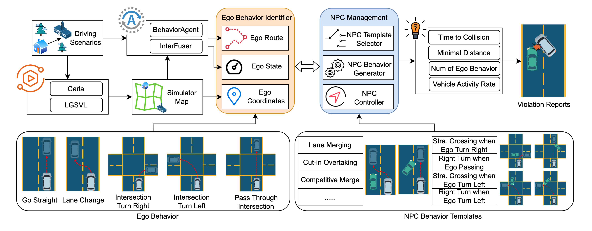
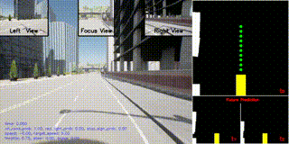
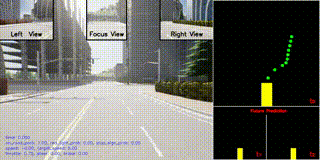
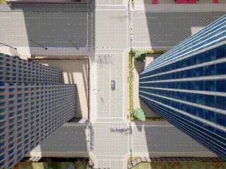
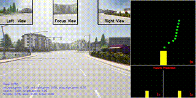
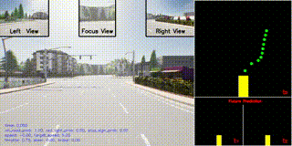

# NPCBehFuzz

Safety-Critical Driving Scenario Generation based on NPC Behavior Management



## Setup

1. Pull the CARLA simulator.

```shell
docker pull carlasim/carla:0.9.13
```

2. Create a Python enviroments by Anaconda.

```shell
conda create -n npcbehfuzz python=3.7
```

3. Install Python dependency.

```shell
pip install carla==0.9.13
pip install loguru matplotlib seaborn numpy
```

4. Install dependency requirement by `InterFuser`.

```shell
cd InterFuser
pip install -r requirements.txt
cd interfuser_code
pip install -r requirements.txt
python setup.py develop
```

5. Download the model weight of `InterFuser`, please refer to the [repository](https://github.com/opendilab/InterFuser).

```shell
cp interfuser.pth.tar InterFuser/team_code/interfuser.pth.tar
```

## Fuzzing with `NPCBehFuzz`

```shell
conda activate npcbehfuzz
python main.py npcbehfuzz 2 # 2 NPC during the simulation
```

### Check the collision report

The collision reports and video recording are saved in directory `results/xxx`.

## Case study

| Collision Type                             | Description                                                                                                 | InterFuser Display                    | Bird's-view                        |
|--------------------------------------------|-------------------------------------------------------------------------------------------------------------|---------------------------------------|------------------------------------|
| Ego Vehicle Turn Left in the Intersection  | InterFuser failed to brake in time even after predicting the trajectory of the object vehicle               |  |  |
| Ego Vehicle Turn Right in the Intersection | InterFuser fails to predict the trajectories of the NPC vehicle in its left                                 |  |  |
| Ego Vehicle Turn Right in the Intersection | InterFuser driving into far lane because it has lower steer, collision with left vehicle                    |  |  |
| Ego Vehicle Changing Lane                  | InterFuser collision with neighboring lane vehicle in changing lane                                         |  |  |
| Ego Vehicle Changing Lane                  | InterFuser collision with left lane stationary vehicle in changing lane, which is waiting for traffic light |  |  |